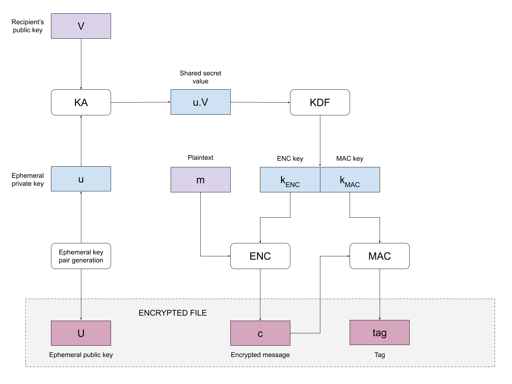

# morscrypta


Elliptic Curve Integrated Encryption Scheme (ECIES) based asymmetric file encryption. Although fully
functional, this project is primarily an exercise in working with cryptographic primitives and 
should be treated as such. I'm not a cryptographer and I make no assertions about the efficacy of
this tool.

```
$ morscrypta help
mors_crypta 0.1.0
Vin Singh <github.com/shampoofactory>
AES-256 file encryption

USAGE:
    morscrypta <SUBCOMMAND>

FLAGS:
    -h, --help       Prints help information
    -V, --version    Prints version information

SUBCOMMANDS:
    decrypt    Decrypt a file.
    encrypt    Encrypt a file.
    help       Prints this message or the help of the given subcommand(s)
    prvkdf     Generate a password derived private key.
    prvsec     Generate a secure random private key.
    pubkey     Generate a private key's corresponding public key.

```

## Quick start using passwords

Complex passwords are essential.

Encryption:

```
$ morscrypta encrypt --in my.file --out my.file.enc --password MyComplexPassword9

```

Decryption:

```
$ morscrypta decrypt --in my.file.enc --out my.file --password MyComplexPassword9
```


## Quick start using keys

Asymmetric encryption requires a valid public-private key pair. The public key is used to encrypt.
The private key is used to decrypt. A public key is generated from a private key, however a private
key cannot be generated from a public key.

The private key is kept secret. One can distribute the public key allowing others to encrypt files
that can only be decrypted using the private key. If the private key is lost, the data is lost.

Generate a random secure private key (recommended):

```
morscrypta prvsec --out_key prv.pem
```

Generate a complex password derived private key:

```
morscrypta prvkdf --password MyComplexPassword9 --out_key prv.pem
```

Generate the corresponding public key for our private key:

```
morscrypta pubkey --in_key prv.pem --out_key pub.pem
```

Encryption:

```
$ morscrypta encrypt --in my.file --out my.file.enc --key pub.pem
```

Decryption:

```
$ morscrypta decrypt --in my.file.enc --out my.file --key prv.pem
```


## OpenSSL key generation

We can also use OpenSSL to generate keys.

Generate a private key:

```
$ openssl genpkey -algorithm X25519 -out prv.pem
```

Generate the corresponding public key for our private key:
```
$ openssl pkey -in prv.pem -pubout -out pub.pem
```

## Internals overview

The core is based on ECIES outlined in the diagram below.

Key size is 256 bits.

Key generation is via CSPRNG or PBKDF2-SHA256 + SALT + 100_000 (default) iterations.

Key agreement (KA) is x25519 ECDH.

Key-derivation function (KDF) is HKDF-SHA256 + INFO MAC/ ENC.

Encryption engine is AES-256 CTR.

MAC is HMAC-SHA256.

Encrypted file format (no magic header):
```
ephemeral public key | cipher text | tag
```

Key files are PEM and OpenSSL compatible.

SALT/ INFO parameters reside in [global.rs](src/lib/global.rs).




## License

`morscrypta` is distributed under the terms of both the MIT license and the Apache License (Version 2.0).

See the [LICENSE-APACHE](LICENSE-APACHE) and [LICENSE-MIT](LICENSE-MIT) files in this repository for more information.


## References

* [Integrated Encryption Scheme](https://en.wikipedia.org/wiki/Integrated_Encryption_Scheme). Wikipedia. 2019.

* Svetlin Nakov. [ECIES Hybrid Encryption Scheme](https://cryptobook.nakov.com/asymmetric-key-ciphers/ecies-public-key-encryption). "Practical Cryptography for Developers". 2018.


* Gayoso Martínez, Hernández Encinas, Sánchez Ávila. "A Survey of the Elliptic Curve Integrated Encryption Scheme". Journal of Computer Science and Engineering, 2, 2 (2010), 7–13.
